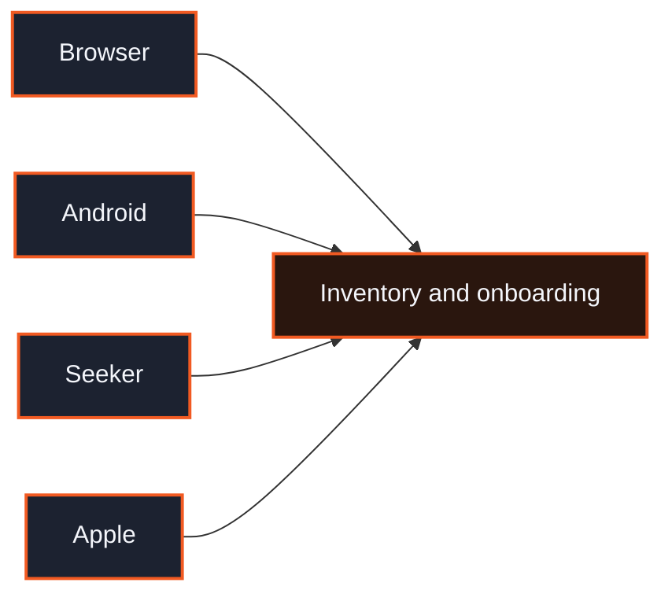

  

  
  
  

  <a href="#inventory"><strong>Inventory</strong></a>
  &nbsp;&nbsp;·&nbsp;&nbsp;
  <a href="#onboarding"><strong>Onboarding</strong></a>
  &nbsp;&nbsp;·&nbsp;&nbsp;
  <a href="#stack"><strong>Stack</strong></a>
  &nbsp;&nbsp;·&nbsp;&nbsp;
  <a href="#where-it-runs"><strong>Where it runs</strong></a>

  

<table>
<tr>
<td width="58%" valign="top">

### Inventory

A catalog of real cards. Each seat is one physical card with a stable identity.

Partners read the catalog, claim the exact cards they need, and can return them. Sandbox and live stay separate. A claim is all-or-nothing: Ript does not substitute a different card when the one you asked for is gone.

[Inventory API guide](https://ript.fun/developers/guide)

### Onboarding

Two paths, both starting at [ript.fun/partners](https://ript.fun/partners).

**Supply.** Bring cards in. Scan or submit them, confirm identity, and pass review. Approved cards become drawable inventory.

**Programs.** Run packs on Ript inventory. Qualify in sandbox, then take a live key and integrate pack claims and buybacks. Keys stay on the server.

</td>
<td width="42%" valign="middle" align="center">

</td>
</tr>
</table>

  

## Stack

  
  
  
  
  
  

| Layer | What it runs on |
| --- | --- |
| Web | TypeScript, React, Vite, Tailwind. Shipped on Cloudflare Pages. |
| API | TypeScript, Fastify, PostgreSQL, Drizzle. Shipped on Railway. |
| Chain | Solana. Purchases settle in USDC. |
| Mobile | Expo. Android, Solana Seeker, and iOS. |
| Media | Card art and studio scans on Cloudflare R2. |

## Where it runs

  <a href="https://github.com/Ript-fun/Ript">Web</a>
  &nbsp;&nbsp;·&nbsp;&nbsp;
  <a href="https://github.com/Ript-fun/Ript-Backend">API</a>
  &nbsp;&nbsp;·&nbsp;&nbsp;
  <a href="https://ript.fun">ript.fun</a>

